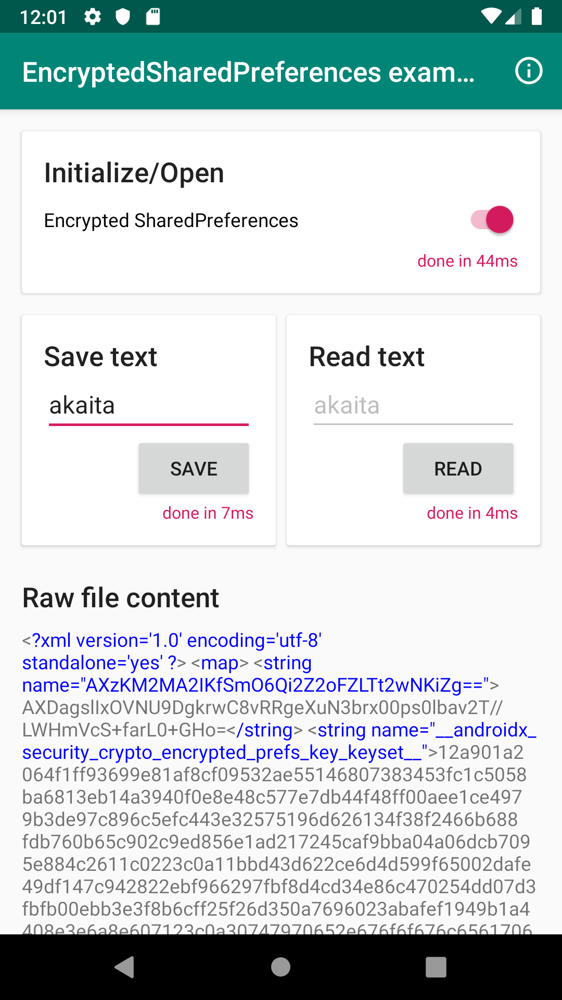

# EncryptedSharedPreferences Example

This repo contains an example app for [EncryptedSharedPreferences, included in AndroidX Crypto](https://developer.android.com/reference/androidx/security/crypto/EncryptedSharedPreferences).

You will find all the interesting methods in [MainActivity](./app/src/main/java/com/akaita/encryptedsharedpreferences/MainActivity.kt).

You can also check the [accompanying article in Medium](https://medium.com/@akaita/encrypted-preferences-in-android-af57a89af7c8) for a more nuanced description.

There are obvious performance concerns about EncryptedSharedPreferences, so I created a demo app and published it the [Play Store](https://play.google.com/store/apps/details?id=com.akaita.encryptedsharedpreferences). Try it out verify the performance you might experience in your test devices.

